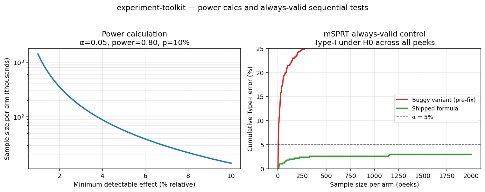

# experiment-toolkit

> Small, well-tested utilities for online controlled experiments.


[](https://pypi.org/project/experiment-toolkit/)
[](https://pypi.org/project/experiment-toolkit/)




A compact Python package covering the calculations that come up in everyday experimentation work: sample sizing, variance reduction, sequential tests, ratio-metric variance, staggered DiD, and sensitivity analysis for observational designs. Each function implements a specific result from the literature and cites it.

Intended audience: analysts, data scientists, and experimentation platform engineers who want a small, inspectable reference implementation rather than a framework.

## Modules

| Module | Purpose |
|--------|---------|
| `sample_size` | Per-arm sample size and MDE, CUPED-aware (`rho` keyword) |
| `cuped` | Deng et al. (2013) CUPED variance reduction |
| `ratio` | Delta-method variance for ratio metrics (revenue per session, etc.) |
| `sequential` | mSPRT always-valid p-values, with optional CUPED compounding |
| `cs_did` | Callaway & Sant'Anna (2021) staggered DiD, robust to heterogeneous cohort effects |
| `sensitivity` | E-value (VanderWeele & Ding) and Rosenbaum bounds |

Every function is typed, tested, and has a paper reference in its docstring.

## Install

```bash
pip install experiment-toolkit
```

Or from source:

```bash
pip install git+https://github.com/wavde/experiment-toolkit.git
```

## Quick start

```python
from experiment_toolkit import sample_size_for_mde, apply_cuped, msprt_pvalue

# Per-arm sample size to detect a 2% lift at sd = 1.0
n = sample_size_for_mde(mde=0.02, std_dev=1.0, alpha=0.05, power=0.80)
# ~39,000 per arm

# CUPED adjustment with a pre-experiment covariate
y_adj = apply_cuped(y, pre_period_y)

# Always-valid p-value, safe to peek
p = msprt_pvalue(delta_hat=0.015, sigma=1.0, n_per_arm=5000, tau=0.05)
```

## CLI

The CLI exposes `sample-size` and `mde`. The other modules are library-only.

```bash
experiment-toolkit sample-size --mde 0.02 --sd 1.0
# Required per-arm sample size: 39,244

experiment-toolkit mde --n 10000 --sd 1.0
# Detectable effect (MDE): 0.0396
```

## Out of scope

Not in this package: a bandit framework, a Bayesian posterior sampler, a full experimentation platform, assignment or exposure logging, multiple-comparison correction beyond what the sequential tests provide. Those belong in separate layers.

## Development

```bash
pip install -e ".[dev]"
pytest
ruff check .
```

## References

- Deng, Xu, Kohavi, Walker (2013). CUPED.
- Deng, Knoblich, Lu (2018). Delta method in metric analytics.
- Johari, Pekelis, Walsh (2015). Always-valid inference.
- Callaway & Sant'Anna (2021). Difference-in-differences with multiple time periods.
- VanderWeele & Ding (2017). Sensitivity analysis in observational research.
- Kohavi, Tang, Xu (2020). *Trustworthy Online Controlled Experiments.*

## License

MIT. See [LICENSE](LICENSE).
